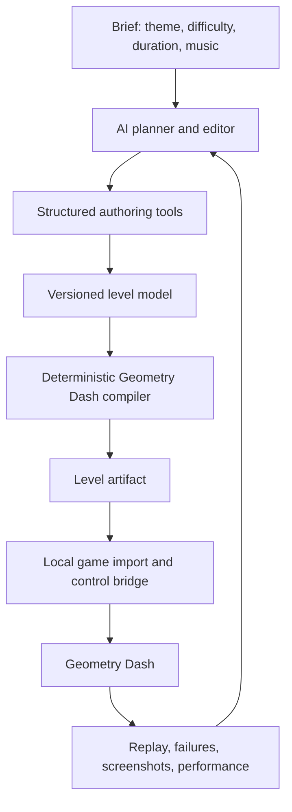

# GDAITRANS

AI-callable tooling for creating Geometry Dash levels from a brief, then inspecting,
playtesting, and improving them without a person placing objects in the editor.

**Current status:** repository initialization and design only. No level generator,
MCP server, or game integration is implemented yet. The Python workspace has no
runtime dependencies; libraries will be selected after compatibility experiments.

## Development setup

Install [uv](https://docs.astral.sh/uv/), then run:

```sh
uv sync --locked
uv run python --version
```

The development interpreter is Python 3.12. This currently creates an environment,
not a runnable level-generation application.

## Direction

The AI should design the level; deterministic tools should handle Geometry Dash's
file format, object placement, and game interaction. An exported file is not proof
that a level is playable, and one successful run is not proof of its difficulty or
visual quality.

Initial choices:

| Area | Choice | Reason |
| --- | --- | --- |
| Authoring core | Python, managed with uv | Convenient file processing and scripting; no model-provider lock-in. |
| AI interface | Local MCP tools over stdio | Exposes structured operations to compatible AI clients. |
| Initial game target | Classic-mode Geometry Dash 2.2 | Start with cube gameplay; record the exact tested game patch, not just "2.2". |
| Artifact | A generated `.gmd` file plus its authoring data | Inspectable and portable; separates generation from access to private saves. |
| Game integration | Prove GDShare import first; build a local Geode bridge for autonomy | GDShare provides import/export buttons, not an autonomous control API. |
| Validation | Static checks plus real-game runs | Format validity, playability, and artistic quality are separate questions. |

Do not start with thousands of mouse clicks, a huge raw level string generated by
an LLM, a web dashboard, a custom physics engine, or model training. The first hard
problem is a reliable round-trip into the actual game.

## End-to-end design



### 1. Structured authoring model

Keep a readable JSON representation rather than treating a compressed level string
as the AI's working document:

- **Brief and metadata:** theme, target difficulty, intended duration, song reference,
  music offset, target game version, and reproducible generation seed.
- **Sections:** gameplay motifs and entry/exit state, including mode, speed, gravity,
  size, and trajectory continuity. Joining individually playable chunks can still
  produce an impossible transition.
- **Objects:** stable internal handles, actual GD object IDs, positions, transforms,
  layers, colors, group memberships, and object-specific properties.
- **Triggers:** typed settings and explicit group/color references; allocate IDs
  centrally so reusable motifs do not collide.
- **Raw properties:** retain unfamiliar imported properties unchanged. Do not
  silently strip data simply because our model does not understand it.

A versioned object catalog should provide names, IDs, property schemas, previews,
and verified collision information where available. The AI searches for objects
by meaning; it should not have to memorize numerical IDs.

Bulk placement, reusable motifs, and section-level transformations are important:
placing 1,000 objects should not require 1,000 model tool calls.

### 2. Compiler and structural checks

GD Docs describes a start/settings object followed by semicolon-separated object
records; each record contains comma-separated property-key/value pairs. That inner
representation and the outer `.gmd` container are distinct layers.

The compiler should produce deterministic output from the same model and seed.
Before exporting, check finite coordinates, property types, supported object IDs,
unique allocated identifiers, valid trigger references, and target-version support.
Return errors attached to the offending internal object handles.

Round-trip experiments must compare meaningful properties, not just file bytes:
the game can normalize its serialized data. Untouched unknown properties must
survive. Never "verify" a level by changing its completion/verification flags.

### 3. Actual-game bridge

Start with an original tiny level exported using GDShare. Reimport it unchanged,
then modify a block or spike through code and reimport it. Record the exact game,
Geode, GDShare, platform, and architecture versions that work.

For the eventual single-agent workflow, a local Geode integration should support
importing into a new editor level, capturing the rendered level, starting a test,
applying timed input, and reporting completion or death. Use actual physics-step
input timing, not wall-clock sleeps. A Python-side adapter can expose this through
the same authoring tools; the bridge itself will likely require C++.

A compatible game installation, loader/mod versions, and local capture/control
permissions are prerequisites for that integration. Their availability on this
machine has not been checked as part of repository initialization. macOS support
is version-specific; do not assume Windows save-file handling applies unchanged.

Do not mutate a live save file or expose an unauthenticated control service on the
network. Prefer importing a new local level. Back up private saves before any
future integration that writes them, and keep those files out of Git.

### 4. Generate, test, then decorate

Build readable gameplay first: ground, jumps, hazards, and a small number of
well-understood motifs. Use a beat grid from supplied BPM/offset initially; map
beats to positions using the actual speed segments. Audio analysis can come after
the basic workflow works.

Generate an intended input sequence alongside the geometry. Run it in the game;
record failure step, player state where available, nearby object handles, and a
screenshot. Let the AI repair the failing section, then rerun the whole level.
The intended sequence is a proposal until the game executes it successfully.

Next, test timing margins around that sequence. A frame-perfect bot completion
alone does not establish that the level matches a human difficulty target.

Only then add a consistent palette, backgrounds, foregrounds, pulses, and other
decoration. Recheck the gameplay path after decoration: visibility, hitboxes,
triggers, and performance can all regress. Use rendered screenshots or recordings
for visual review; JSON alone cannot establish artistic quality.

## Proposed AI tool surface

These are design targets, not existing commands:

| Tool | Responsibility |
| --- | --- |
| `find_objects` | Search the versioned object catalog and inspect supported settings. |
| `create_level` | Start a document from a brief and explicit game settings. |
| `edit_level` | Apply batched placement, updates, deletions, motifs, and transforms. |
| `inspect_level` | Read sections, objects, bounds, and authoring state. |
| `validate_level` | Return structural errors and warnings with object references. |
| `export_level` | Compile the document to a level artifact. |
| `import_level` | Load the artifact into a new local editor level through the bridge. |
| `playtest_level` | Execute an input sequence and return observed game results. |
| `capture_level` | Return real rendered views for AI visual assessment. |

Keep authoring logic independent of MCP so a CLI and direct model function calls
can reuse it. Choose the AI provider outside the core. A caller without vision
can author geometry but cannot independently judge the rendered appearance.

## Implementation order and acceptance gates

1. **Compatibility proof:** an original tiny level survives export, decode,
   unchanged re-encode, and real-game reimport; a code-moved object appears in the
   expected position. Preserve every untouched property.
2. **Useful authoring core:** create a short cube layout from structured data,
   compile it, and open it in the game. Invalid references produce actionable
   errors rather than broken artifacts. This gate can still use manual import.
3. **AI authoring:** an AI client can find objects, create a document, edit it in
   batches, inspect errors, and export a layout without manually manipulating the
   editor. Demonstrate the resulting layout in the game.
4. **Autonomous game loop:** the same client imports, captures, tests, detects a
   deliberately failing section, repairs it, and completes a full real-game run
   without manual editor work. Save input timing and the game-version evidence.
5. **Complete level quality:** add music synchronization, readable decoration,
   calibrated timing margins, and a performance check; rerun the full final level.

The first vertical slice should be a short, simple cube level. This is a proof of
the pipeline, not a restriction on the final tool: other modes, complex triggers,
and platformer levels come after their game behavior can be exercised reliably.
A fully autonomous finished level requires both the authoring tools and the real
game feedback loop; a file exporter alone does not meet the goal.

Online level publishing is separate from local creation and is not part of the
initial tool. No account credentials, copied level collections, or bundled music
are needed for this initialization. Use original fixtures and assets we may use.

## Research and dependency decisions

- [GD Docs: level container](https://github.com/Wyliemaster/gddocs/blob/master/docs/resources/client/level.md),
  [object string](https://github.com/Wyliemaster/gddocs/blob/master/docs/resources/client/level-components/level-string.md),
  and [start settings](https://github.com/Wyliemaster/gddocs/blob/master/docs/resources/client/level-components/level-start.md)
  document the community-understood format. The object reference explicitly notes
  that its older property table is incomplete for 2.2; validate against exports
  from the target game rather than assuming complete coverage.
- [GDShare](https://github.com/HJfod/GDShare) provides local `.gmd` import/export.
  Its [mod manifest](https://github.com/HJfod/GDShare/blob/HEAD/mod.json) currently
  declares GD 2.2081 support, including macOS. This does not establish compatibility
  with an untested local installation.
- [GMDKit](https://github.com/UHDanke/gmdkit) is a candidate Python codec/toolkit.
  Its README warns that it lacks save-editing safety checks and may discard
  unrecognized data. Evaluate it against the round-trip gate before adopting it;
  do not let it destructively rewrite private saves.
- [MCP tools specification](https://modelcontextprotocol.io/specification/2026-07-28/server/tools)
  provides discoverable tools with structured input schemas. No MCP dependency is
  installed yet; select an SDK compatible with the actual AI client.

No distribution license has been selected. A public GitHub repository is not, by
itself, a grant of reuse rights.
